# Первый файл по контролю версий(проверка заголовка)_1 \# Заголовок1
## Первый файл по контролю версий -  \#\# Заголовок2
#
### Первый файл по контролю версий - \#\#\# Заголовок3 
#
#### Первый файл по контролю версий - \#\#\#\# Заголовок4
#
##### Первый файл по контролю версий- \#\#\#\#\# Заголовок5
#
###### Первый файл по контролю версий - \#\#\#\#\#\# Заголовок6
#
**Проверка записи полужирным шрифтом** \*\*Текст полужирный\*\*
#
**После того как Git установлен в системе и введены учетные данные,
имя и email. Для того что бы отслеживать изменеия в дирректории.
Необходимо инициализировать Git на ней. 
Встать на дирректорию и выполнить команду инициализации, - *Git Init*.
Выполнить данное действие можно как в обычной консоли, консли PS, либо во 
встроенной консоли Visual Studio Code.**
#
Прверка вставок картинок в MarkDown:

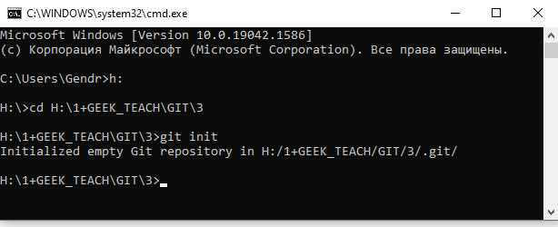

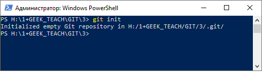

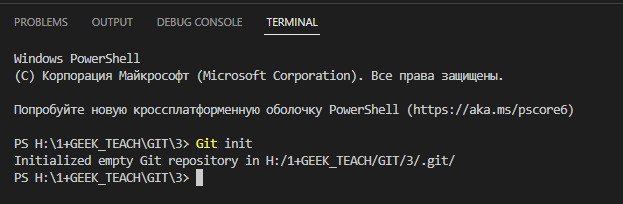

*Проверка записи курсивом* \*Текст курсивом\*
#
*Для того чтобы начать отслеживать изменение файлов в репозитории, их нужно добавить командой add "имя файла", либо add "." если необходимо добавить все файлы в дирректории.*

>Что бы добавит все файлы находящиеся в дирректории в репозиторий используйте комманду add ".".

Выполняем фиксацию "commit", командой commit с передаваемыми параметрами -a ("all" фиксация всех изменений файлов), -m ("message" комментарий).
#
Команда Git status отображает есть ли не добавленные (не отслеживаемые) в репозиторий файлы. Отображает были ли файлы модифицированы от предыдущего коммита либо если коммита еще не было, от первичного состояния при добавлении.

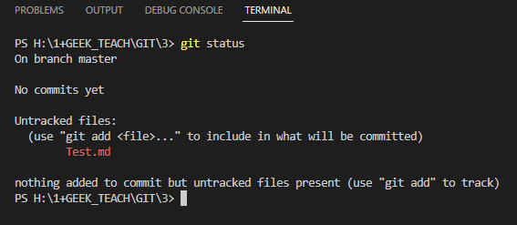

Как видно присутствует 1 недобавленный файл в дирректории. Добавим его:
При помощи команды add:

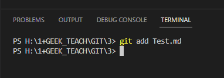

Теперь проверим что покажет команда status. Нет коммитов, но есть в репозитории новый файл.

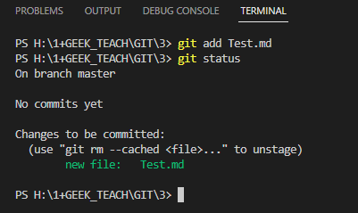

Произведем сохранение начальной копии, сделаем первый коммит.

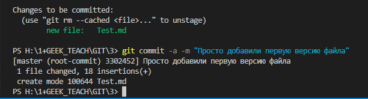

А что теперь отобразит команда status?  Статус говорит что коммитить нечего, изменений нет. 

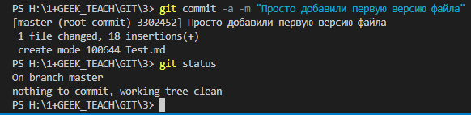

А если сделать изменеия? Что тогда скажет статус?
#

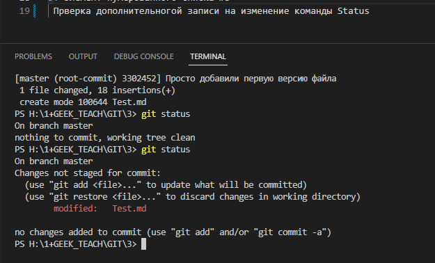

Как видно статус отображает не только добавление новых файлов, но и их изменение.
Т.е. следующий коммит уже добавит изменения файла в репозиторий.

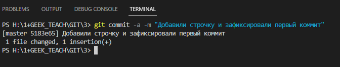

На самом деле это уже не первый, а второй коммит, и проверить это нам поможет команда Log.

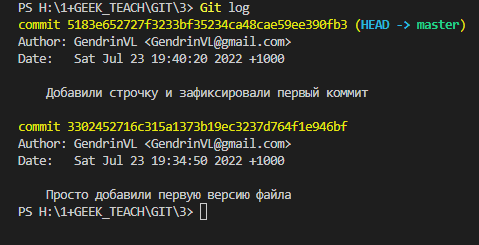

>Циттата в MarkDown. При использовании Git Log отображаются последние коммиты, что бы отобразить все коммиты необходимо добавить параметр --graph.
#

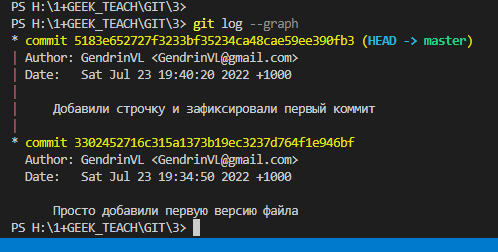

Как видно из картинок мы коммитим дирректорию H:\1+GEEK_TEACH\GIT\3.
При этом задание выполняется в другой дирректории, где у меня расположен файл Lesson1.md который закоммитен уже в другом репозитории.
Его путь: H:\1+GEEK_TEACH\GIT\GitLesson1
Перейдем туда на терминале и сделаем коммит последнийх изменений этого файла:
Заодно отобразим в MarkDown нумерованные списки:

1. Переход: cd H:\1+GEEK_TEACH\GIT\GitLesson1
2. Выполняем самм коммит: git commit -a -m "Фиксируем Картинки, Цитаты, Списки МД и Status Log Git"

И не нумерованные списки:
#
* Пункт1
* Пункт2

Многоуровневые списки:

* Пункт1
    * Пункт2
        1. Пункт3
            * Пункт4
            * Пункт5

Добавим сюда ссылку на GitHab:

[Ссылка на GitHab которая нам скоро понадобится](https://github.com/ "GitHab") 

Теперь осталось научится перемещаться по нашим сохранениям ("коммитам").
Перемещения по коммитам осуществляются при помощи комманды checkout и не менее четырех символов из хеша коммита.

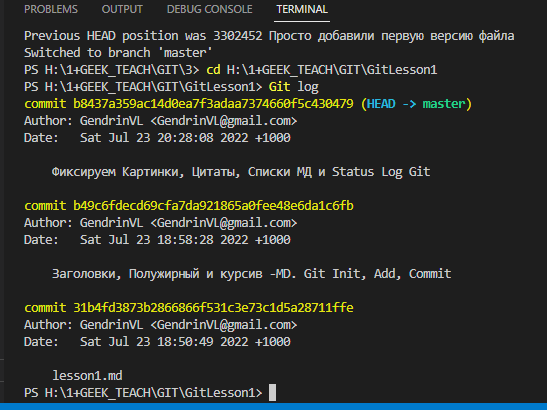

Так как я еще добавлял информацию в файл, то перед переходом на другой коммит необходимо произвести фиксацию последнего состояния, иначе мы потеряем данные.

> Не забудьте при этом сначала сохранить файл! Кстати Git предупредит вас что не все изменения сохранены и попромит перед тем как перемещаться по коммитам, произвисти сохранение в последний/новый коммит.

git commit -a -m "Многоуровневые списки, ссылки МД"
#

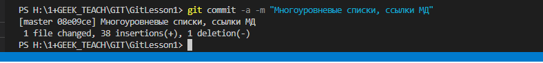

переходим на первый коммит в репозитории:

git checkout 31b4

в результате возвращаемся к самому началу редактируемого документа (первая версия)

git checkout master - (возвращаемся к последней редактируемой версии)
#
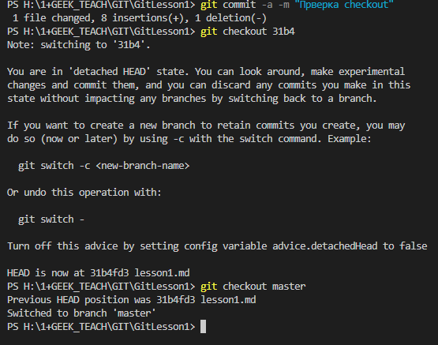

Как видно после перемещения на 31b4 Git нам говорит что если мы хотим открыть новый branch то используйте такие то команды, это относится к ветвлениям и будет рассказано на следующем уроке.
#

# Вторая работа по контролю версий -  \#\# Работаем с ветками, объединение веток.
#
> На семинаре упоминалось что все графические файлы желательно хранить в папке images, в локальном репозитории произвести корректировку довольно просто. Добавляем папку, исправляем пути к файлам, переносим файлы в новую папку. Однако посли синхронизации с облаком, на обаке файлы графики будут удалены и картинок не будет. Решение: создание руками папкина GitHab (Images) и добавление в нее файлов. Возможно есть други способы, меня устроил этот.

Добавляем четыре ветки в репозиторий. Fierst_Br, Second_Br, Third_Br, Fourth_Br.
#
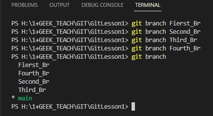
#
Выполняем коммит и переходим к первой, добавляем запись, затем ко второй добавляем запись.
Производим первое слияние (первая ветка)